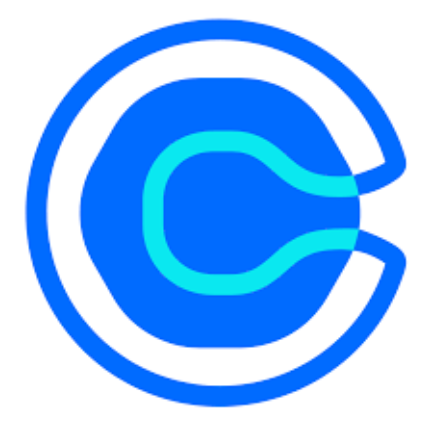
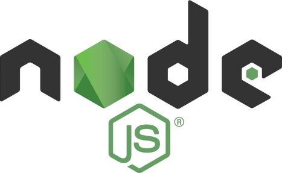

# 

## How to Run the Project Locally

1. **Clone the Repository**:

   ```bash
   git clone https://github.com/CheeGuang/Mindsphere
   ```

2. **Request the Environment File**:
   Request the .env file from Jeffrey on Telegram (@CheeGuang).
3. **Install Dependencies**:
   ```
   cd mindsphere
   npm install
   ```
4. **Run the Project**:

   ```
   npm start
   ```

5. **Access the Application**:
   Open your browser and navigate to http://localhost:8000.
6. **Start AWS RDS Database**:  
   Contact Jeffrey on Telegram (@CheeGuang) to initiate the AWS RDS database.

## Deployment

The project, hosted on Render at https://mindsphere.onrender.com/, is temporarily unavailable. For access, please contact Jeffrey on Telegram (@CheeGuang).

## Introduction

### Problem Statement

How can we increase the efficiency of the client onboarding process?

### Context

This project was developed for the Full Stack Development Project (FSDP) module, focusing on addressing real-world problems through innovative solutions. Leveraging our technical skills and knowledge, we revamped **MindSphere** to streamline client onboarding and deliver exceptional user experiences.

## Project Details

### Project Name: MindSphere (Team Cooking Revamp)

#### Objective

Mindsphere (Team Cooking Revamp) strives to provide an industry-standard, scalable, and cost-efficient platform that enhances marketing, boosts event sign-ups, empowers coaches to create events and offer 1-1 executive coaching, while enabling data-driven decisions to streamline processes and empower learners.

#### Target Audience

1. **B2C Customers**:  
   

2. **B2B Customers**:  
   

3. **MindSphere CEO and Coaches**:  
   

> **View the Persona on Visme**: https://my.visme.co/view/epqrjmpr-fsdp-teamcooking-userpersona

## User Flow

The following diagram illustrates the user flow for B2C customers, B2B customers, and the CEO & Coaches. It showcases the steps and processes specific to each user group to navigate through the MindSphere platform.


> **View the User Flow on FigJam**: https://www.figma.com/board/4u4CTEU9V41YzT3OFOwqUt/User-Flow-Diagram-Template-for-FigJam-(Community)?node-id=0-1&t=oFSyh7zidoioE9h6-1

## Key Features

<table>
  <tr>
    <th style="width: 130px; text-align: center;">Feature</th>
    <th>Description</th>
    <th>Target Audience</th>
  </tr>
  <tr>
    <td style="text-align: center;">IntelliSphere AI Coach</td>
    <td>AI feedback on public speaking with course recommendations using OpenAI.</td>
    <td>B2C</td>
  </tr>
  <tr>
    <td style="text-align: center;">MindSphere Telegram Channel</td>
    <td>Notifies users of upcoming events via Telegram.</td>
    <td>B2C</td>
  </tr>
  <tr>
    <td style="text-align: center;">1-to-1 Executive Coaching</td>
    <td>Video conferencing and appointment booking with coaches via Whereby & Calendly.</td>
    <td>B2C</td>
  </tr>
  <tr>
    <td style="text-align: center;">Member & Admin Account System</td>
    <td>Manage user accounts with role-based access control for members and admins.</td>
    <td>B2C</td>
  </tr>
  <tr>
    <td style="text-align: center;">Referral System</td>
    <td>Users can refer friends and earn gift cards.</td>
    <td>B2C</td>
  </tr>
  <tr>
    <td style="text-align: center;">Gift Cards</td>
    <td>Digital gift cards to be redeemed for events and services.</td>
    <td>B2C</td>
  </tr>
  <tr>
    <td style="text-align: center;">Feedback Form</td>
    <td>Collect and analyze feedback from users for actionable insights.</td>
    <td>B2C</td>
  </tr>
  <tr>
    <td style="text-align: center;">Location Finder</td>
    <td>Helps users locate location of events.</td>
    <td>B2C</td>
  </tr>
  <tr>
    <td style="text-align: center;">Enroll for Event</td>
    <td>Allows users to register for events seamlessly.</td>
    <td>B2C</td>
  </tr>
  <tr>
    <td style="text-align: center;">B2B Collaboration Form</td>
    <td>Streamlines collaboration proposals for businesses.</td>
    <td>B2B</td>
  </tr>
  <tr>
    <td style="text-align: center;">MindSphere Dashboard</td>
    <td>Provides charts to display business insights, empowering driving data-driven decision-making.</td>
    <td>CEO and Coaches</td>
</tr>

  <tr>
    <td style="text-align: center;">Mind+ Reminders</td>
    <td>Notify members about expiring memberships and encourage event sign-ups.</td>
    <td>CEO and Coaches</td>
  </tr>
  <tr>
    <td style="text-align: center;">Event Manager</td>
    <td>Manage and schedule events efficiently.</td>
    <td>CEO and Coaches</td>
  </tr>
  <tr>
    <td style="text-align: center;">B2B Management System</td>
    <td>Oversee and manage collaborations with businesses.</td>
    <td>CEO and Coaches</td>
  </tr>
</table>

## Technology Used

<table>
  <tr>
    <th style="width: 130px; text-align: center;">Technology Used</th>
    <th>Description</th>
  </tr>
  <tr>
    <td style="text-align: center;">
      <br>Calendly
    </td>
    <td>Used for hassle-free appointment scheduling and integration with calendar systems. Specifically utilised for scheduling 1-1 Executive Coaching with Coaches.</td>
  </tr>
  <tr>
    <td style="text-align: center;">
      <br>Google OAuth2
    </td>
    <td>Provides secure and user-friendly authentication for Members to easily sign into their accounts with Single Sign-On (SSO).</td>
  </tr>
  <tr>
    <td style="text-align: center;">
      <br>OpenAI
    </td>
    <td>Integrates Whisper and GPT-4-mini for speech-to-text conversion and speech analysis to evaluate how well a user spoke.</td>
  </tr>
  <tr>
    <td style="text-align: center;">
      <br>AWS S3
    </td>
    <td>Used to store invoice PDFs, temporary speech MP3 files, and event pictures, enabling external APIs to access these media files.</td>
  </tr>
  <tr>
    <td style="text-align: center;">
      <br>AWS RDS
    </td>
    <td>Hosts the entire Mindsphere Database, ensuring scalability and security.</td>
  </tr>
  <tr>
    <td style="text-align: center;">
      <br>Telegram Bot
    </td>
    <td>Automates programmatic announcements of new events to Mindsphere members.</td>
  </tr>
  <tr>
    <td style="text-align: center;">
      <br>Chart.js
    </td>
    <td>Used in the Mindsphere Dashboard to provide the CEO and Coaches with company and event insights, driving data-driven decision-making.</td>
  </tr>
  <tr>
    <td style="text-align: center;">
      <br>TensorFlow
    </td>
    <td>Facilitates Facial Expression Recognition, enhancing speech analysis capabilities.</td>
  </tr>
  <tr>
    <td style="text-align: center;">
      <br>SMTP
    </td>
    <td>Enables efficient email notifications, reminders, and invoice distribution.</td>
  </tr>
  <tr>
    <td style="text-align: center;">
      <br>Whereby
    </td>
    <td>API used for hosting seamless 1-1 Executive Coaching sessions.</td>
  </tr>
  <tr>
    <td style="text-align: center;">
      <br>Postman
    </td>
    <td>Used for API testing and integration debugging.</td>
  </tr>
  <tr>
    <td style="text-align: center;">
      <br>Render
    </td>
    <td>Provides seamless web hosting and deployment solutions.</td>
  </tr>
  <tr>
    <td style="text-align: center;">
      <br>Git/GitHub
    </td>
    <td>Used for version control and collaboration among team members.</td>
  </tr>
  <tr>
    <td style="text-align: center;">
      <br>Node.js
    </td>
    <td>Serves as the backend runtime for robust server-side operations.</td>
  </tr>  
</table>

## Pricing

<table>
  <tr>
    <th>S/N</th>
    <th>Tool Name</th>
    <th>Cost per Month</th>
    <th>Remarks</th>
    <th>Link</th>
  </tr>
  <tr>
    <td>1</td>
    <td>GitHub</td>
    <td>$0.00</td>
    <td></td>
    <td></td>
  </tr>
  <tr>
    <td>2</td>
    <td>Visual Studio Code</td>
    <td>$0.00</td>
    <td></td>
    <td></td>
  </tr>
  <tr>
    <td>3</td>
    <td>Figma</td>
    <td>$0.00</td>
    <td></td>
    <td></td>
  </tr>
  <tr>
    <td>4</td>
    <td>AWS S3</td>
    <td>$0.00</td>
    <td></td>
    <td></td>
  </tr>
  <tr>
    <td>5</td>
    <td>AWS Relational Database</td>
    <td>$0.00</td>
    <td></td>
    <td></td>
  </tr>
  <tr>
    <td>6</td>
    <td>Calendly</td>
    <td>$0.00</td>
    <td>
      Current benefits include:<br>
      - One event type with unlimited meetings<br>
      - Connect one calendar and basic integrations<br>
      - Customize your booking page<br>
      - Send confirmation emails<br>
      - Embed scheduling on your site<br>
      - Mobile app & browser extension
    </td>
    <td><a href="https://calendly.com/pricing/users">Calendly Pricing</a></td>
  </tr>
  <tr>
    <td>7</td>
    <td>Whereby</td>
    <td>$0.00</td>
    <td>
      2,000 participant minutes, renewed monthly<br>
      Estimated around 16 calls per month<br>
      Assume all users call once a month
    </td>
    <td><a href="https://whereby.com/information/embedded/pricing">Whereby Pricing</a></td>
  </tr>
  <tr>
    <td>8</td>
    <td>Telegram Bot</td>
    <td>$0.00</td>
    <td></td>
    <td></td>
  </tr>
  <tr>
    <td>9</td>
    <td>Google OAuth2</td>
    <td>$0.00</td>
    <td>Only when MAU < 49,999</td>
    <td><a href="https://cloud.google.com/identity-platform/pricing">Google OAuth2 Pricing</a></td>
  </tr>
  <tr>
    <td>10</td>
    <td>Google SMTP</td>
    <td>$0.00</td>
    <td></td>
    <td></td>
  </tr>
  <tr>
    <td>11</td>
    <td>Open AI Whisper + GPT 4-mini</td>
    <td>$3.00</td>
    <td>Assume all users use it twice a month</td>
    <td><a href="https://openai.com/api/pricing/">OpenAI Pricing</a></td>
  </tr>
  <tr>
    <td colspan="2"><strong>Total Price</strong></td>
    <td><strong>$3.00</strong></td>
    <td>50 members on the website</td>
    <td></td>
  </tr>
  <tr>
    <td colspan="2"><strong>Additional Cost</strong></td>
    <td><strong>$25.00</strong></td>
    <td>For every additional 50 users</td>
    <td></td>
  </tr>
</table>

## Security Analysis

This section highlights the security measures implemented to ensure the safety of customer data and secure communication channels.

### **Customer Data Security**

We adhere to industry standards such as **GDPR**, **HIPAA**, **ISO 27001**, and **SOC2** to ensure that customer data is securely stored and managed.

- **AWS S3**: Secure object storage for files.
- **AWS RDS**: Reliable relational database service for scalable data management.
- **Google Dev**: Authentication and service integration for enhanced security.
- **Render**: Reliable and secure hosting for web applications.

### **End-to-End Encryption**

All communications are encrypted to maintain user privacy and confidentiality.

- **Whereby**: Secure video conferencing platform.
- **Telegram Bot**: Secure announcements and notifications.

### **Data Encryption in Transit**

Data is securely transmitted using industry-standard encryption protocols.

- **SMTP**: Secure email delivery for notifications and invoices.
- **Calendly**: Safe integration for scheduling appointments.
- **OpenAI**: Encryption ensures the secure use of AI services.

## Future Enhancements

We envision several innovative features and enhancements for MindSphere to further streamline operations, improve user experience, and drive engagement. These enhancements are tailored to meet the evolving needs of our target audiences:

### **B2C Enhancements**

1. **Community Forum**

   - A dedicated forum for members to share ideas, ask questions, and collaborate, fostering a sense of community and peer-to-peer learning.

2. **AI Chatbot Support**

   - 24/7 support powered by AI to answer queries, guide users, and troubleshoot issues in real-time.

3. **Subscription-Based Gamified Learning Experience**
   - An engaging, subscription-based platform incorporating gamified elements like badges, leaderboards, and rewards to motivate learning and skill development.

### **B2B Enhancements**

1. **AI-Powered Personalised Learning Path**

   - Advanced AI algorithms to recommend customised learning paths based on employee performance, industry trends, and organisational goals.

2. **MindSphere Certification**
   - A certification programme recognising companies and individuals who excel in using the platform, boosting their credentials and trustworthiness.

### **CEO Enhancements**

1. **Employee Performance Insights Dashboard**

   - A comprehensive dashboard offering insights into employee engagement, learning progress, and performance metrics.

2. **Meetup Events**
   - Tools to organise and manage in-person or virtual meetup events, fostering networking and collaboration opportunities.

## Contributors

Meet the team behind the Mindsphere project:

- **Jeffrey**: Product Owner, Fullstack Developer
- **Sian Kim**: Scrum Master, Fullstack Developer
- **Yee Hen**: Fullstack Developer
- **Hong Rong**: Fullstack Developer
- **Danish**: Frontend Developer, UI/UX Designer
- **Sarrinah**: Frontend Developer, UI/UX Designer
